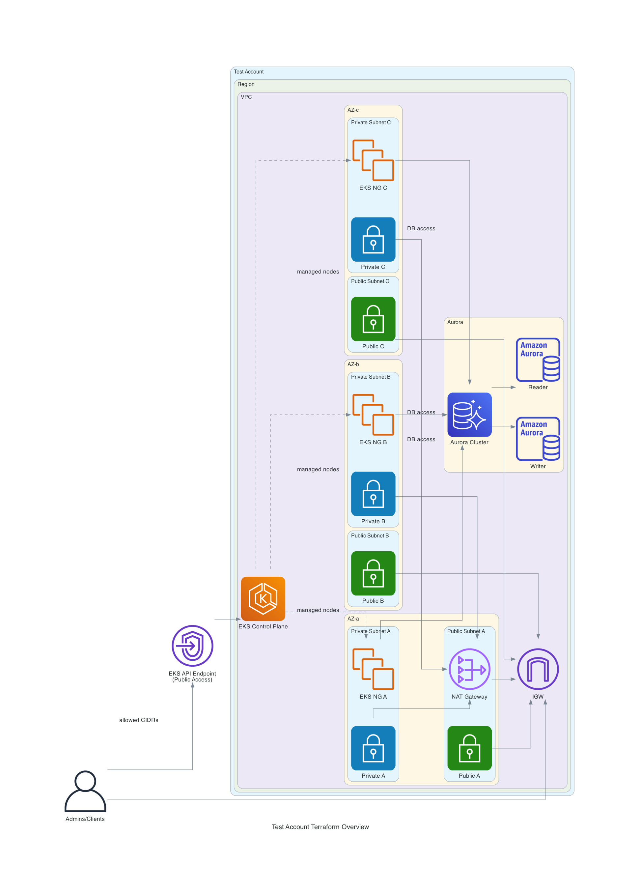
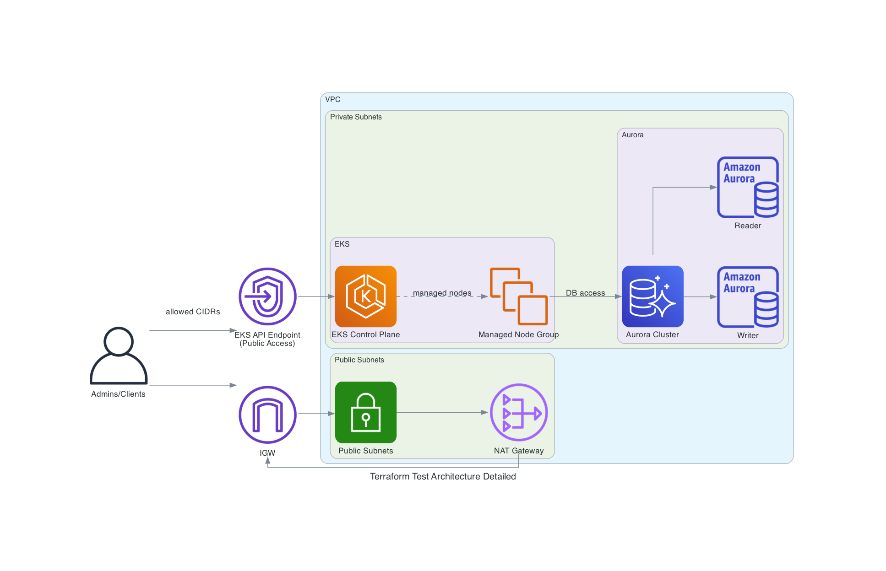

# AWS Infrastructure

AWS infrastructure repository using Terraform. It defines a networking baseline (VPC),
an EKS cluster, and an Aurora database using reusable modules.

## Structure

```
.
├── terraform/
│   ├── env/
│   │   └── test/
│   │       ├── main.tf
│   │       ├── locals.tf
│   │       ├── outputs.tf
│   │       ├── providers.tf
│   │       ├── terraform.tfvars.example
│   │       ├── variables.tf
│   │       └── versions.tf
│   └── modules/
│       ├── aurora/
│       ├── eks/
│       └── vpc/
└── generated-diagrams/
```

## Architecture

High-level diagram:



Detailed diagram (AZs and dependencies):



## Requirements

- Terraform >= 1.11.1
- AWS Provider >= 6.28
- AWS credentials configured (environment variables or AWS CLI profile)
- S3 backend available (see `terraform/env/test/versions.tf` for bucket/region)

## Modules

- `terraform/modules/vpc`: VPC with public/private subnets and NAT Gateway.
- `terraform/modules/eks`: EKS cluster with managed node group and IRSA enabled.
- `terraform/modules/aurora`: Aurora cluster with dedicated SG and access from EKS nodes.

## Inputs (env/test)

Defined in `terraform/env/test/variables.tf` and exemplified in
`terraform/env/test/terraform.tfvars.example`.

| Input | Description | Type |
| --- | --- | --- |
| project | Project name used as prefix. | string |
| environment | Environment (dev, stage, prod, ...). | string |
| region | AWS region to deploy to. | string |
| vpc_cidr | VPC CIDR. | string |
| availability_zones | AZs to use in the region. | list(string) |
| public_subnets_cidrs | CIDRs for public subnets. | list(string) |
| private_subnets_cidrs | CIDRs for private subnets. | list(string) |
| kubernetes_version | Kubernetes version for EKS. | string |
| eks_instance_types | Instance types for node groups. | list(string) |
| eks_endpoint_public_access_cidrs | Allowed CIDRs for the EKS public endpoint. | list(string) |
| eks_min_size | Minimum node group size. | number |
| eks_max_size | Maximum node group size. | number |
| eks_desired_size | Desired node group size. | number |
| eks_admin_principals | List of ARNs with cluster admin access. | list(string) |
| aws_profile | AWS profile (if used). | string |
| aurora_engine | Aurora engine. | string |
| aurora_engine_version | Aurora engine version. | string |
| aurora_instance_class | Aurora instance class. | string |
| aurora_master_username | Aurora admin username. | string |
| aurora_database_name | Initial database name. | string |
| aurora_port | Aurora port. | number |

## Outputs (env/test)

Defined in `terraform/env/test/outputs.tf`.

| Output | Description |
| --- | --- |
| vpc_id | VPC ID. |
| public_subnets | Public subnet IDs. |
| private_subnets | Private subnet IDs. |
| eks_cluster_name | EKS cluster name. |
| eks_cluster_endpoint | EKS cluster endpoint. |
| aurora_cluster_endpoint | Aurora writer endpoint. |
| aurora_reader_endpoint | Aurora reader endpoint. |

## Notes

- Aurora uses `manage_master_user_password = true`; the password is managed in AWS.
- Aurora security allows access from the EKS node security group.
